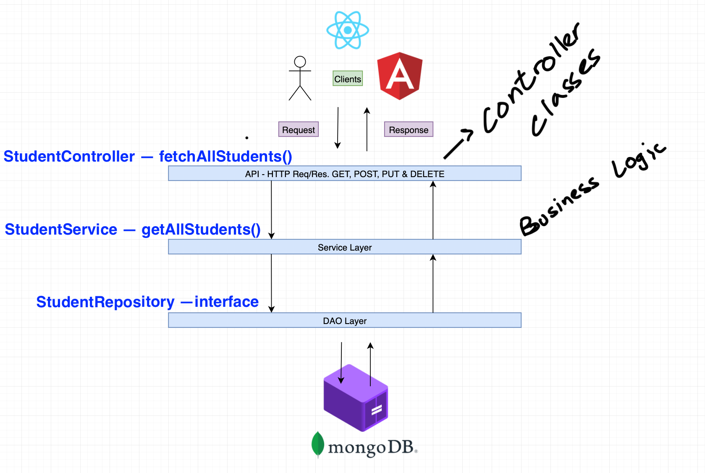

### Trying out MongoDB with Spring Boot 

If you want to try this out and don't have mongodb installed, you can use the docker-compose.yaml file to create a mongodb container and then use that for this practice project.

P.S. I only have the GET endpoint Mapping. I'll soon add POST, PUT and delete (method already exists)

